# Jarkom-Modul-2-B18-2023

## Kelompok B18

|          Nama          |    NRP     |
| :--------------------: | :--------: |
|  Aryan Shafa Wardana   | 5025211031 |
| Shazia Ingeyla Naveeda | 5025211203 |

## Nomor 1

### Soal <br>

Yudhistira akan digunakan sebagai DNS Master, Werkudara sebagai DNS Slave, Arjuna merupakan Load Balancer yang terdiri dari beberapa Web Server yaitu Prabakusuma, Abimanyu, dan Wisanggeni. Buatlah topologi [dengan pembagian](https://docs.google.com/spreadsheets/d/1OqwQblR_mXurPI4gEGqUe7v0LSr1yJViGVEzpMEm2e8/edit#gid=1475903193).sebagai berikut. Folder topologi dapat diakses pada [drive berikut.](https://drive.google.com/drive/folders/1Ij9J1HdIW4yyPEoDqU1kAwTn_iIxg3gk)

### Pembahasan<br>

Topologi yang kelompok B18 gunakan adalah topologi [04,](https://drive.google.com/drive/folders/1Ij9J1HdIW4yyPEoDqU1kAwTn_iIxg3gk) dimana **NAT1** terhubung ke **Router**, yang kemudian terhubung ke 3 switch yang masing-masing terhubung ke beberapa node. Seperti **Switch1** yang terhubung ke node **DNS**, lalu **Switch2** yang terhubung ke node **Load Balancer** dan **Web Server**, sedangan **Switch3** terhubung ke node **Client**

> Topologi Kelompok B18


**Konfigurasi Node**

- ROUTER - _Pandudewanata_

  ```
  auto eth0
  iface eth0 inet static
  	address 192.187.0.1
  	netmask 255.255.255.0

  auto eth1
  iface eth1 inet static
  	address 192.187.1.1
  	netmask 255.255.255.0

  auto eth2
  iface eth2 inet static
  	address 192.187.2.1
  	netmask 255.255.255.0

  auto eth3
  iface eth3 inet dhcp
  ```

- DNS MASTER - _Yudhistira_

  ```
  auto eth0
  iface eth0 inet static
  	address 192.187.2.2
  	netmask 255.255.255.0
  	gateway 192.187.2.1
  ```

- DNS SLAVE - _Werkudara_

  ```
  auto eth0
  iface eth0 inet static
  	address 192.187.2.3
  	netmask 255.255.255.0
  	gateway 192.187.2.1
  ```

- LOAD BALANCER - _Arjuna_

  ```
  auto eth0
  iface eth0 inet static
  	address 192.187.1.5
  	netmask 255.255.255.0
  	gateway 192.187.1.1
  ```

- WEB SERVER - _Abimanyu_

  ```
  auto eth0
  iface eth0 inet static
  	address 192.187.1.2
  	netmask 255.255.255.0
  	gateway 192.187.1.1
  ```

- WEB SERVER - _Prabukusuma_

  ```
  auto eth0
  iface eth0 inet static
  	address 192.187.1.3
  	netmask 255.255.255.0
  	gateway 192.187.1.1
  ```

- WEB SERVER - _Wisanggeni_

  ```
  auto eth0
  iface eth0 inet static
  	address 192.187.1.4
  	netmask 255.255.255.0
  	gateway 192.187.1.1
  ```

- CLIENT - _Nakula_

  ```
  auto eth0
  iface eth0 inet static
  	address 192.187.0.2
  	netmask 255.255.255.0
  	gateway 192.187.0.1
  ```

- CLIENT - _Sadewa_

  ```
  auto eth0
  iface eth0 inet static
  	address 192.187.0.3
  	netmask 255.255.255.0
  	gateway 192.187.0.1
  ```

## Nomor 2 dan Nomor 3

### Soal Nomor 2

Buatlah website utama pada node arjuna dengan akses ke **arjuna.yyy.com** dengan alias **www.arjuna.yyy.com** dengan yyy merupakan kode kelompok.

### Soal Nomor 3

Dengan cara yang sama seperti soal nomor 2, buatlah website utama dengan akses ke **abimanyu.yyy.com** dan alias **www.abimanyu.yyy.com**.

### Pembahasan

**Pembuatan Domain**

- Edit konfigurasi **named.conf.local** dengan menambahkan zone untuk masing-masing domain. Lakukan perintah berikut pada _Yudhistira_

  ```
  nano /etc/bind/named.conf.local
  ```

- Isikian Konfigurasi domain seperti syntax berikut:

  ```
  zone "arjuna.b18.com" {
  type master;
  file "/etc/bind/website/arjuna.b18.com";
  };

  zone "abimanyu.b18.com" {
  type master;
  file "/etc/bind/website/abimanyu.b18.com";
  };
  ```

- Kemudian buka file masing-masing domain. Edit name server dan alamat IPnya. Dan tambahkan konfigurasi untuk membuat alias dengan tipe `CNAME`

> Domain Arjuna

```bind
$TTL    604800
@       IN      SOA     arjuna.b18.com. root.arjuna.b18.com. (
                              2         ; Serial
                         604800         ; Refresh
                          86400         ; Retry
                        2419200         ; Expire
                         604800 )       ; Negative Cache TTL
;
@       IN      NS      arjuna.b18.com.
@       IN      A       192.187.1.5       ; IP LB- Arjuna
www     IN      CNAME   arjuna.bl8.com.
@       IN      AAAA    ::1
```

> Domain Abimanyu

```bind
$TTL    604800
@       IN      SOA     abimanyu.b18.com. root.abimanyu.b18.com. (
                              2         ; Serial
                         604800         ; Refresh
                          86400         ; Retry
                        2419200         ; Expire
                         604800 )       ; Negative Cache TTL
;
@       IN      NS      abimanyu.b18.com.
@       IN      A       192.187.1.2       ; IP Abimanyu
www     IN      CNAME   abimanyu.bl8.com.
@       IN      AAAA    ::1
```

**Testing**

```
ping arjuna.b18.com
ping abimanyu.b18.com

ALIASNYA
ping www.arjuna.b18.com
ping www.abimanyu.b18.com
```


> **arjuna.b18.com**


## Nomor 4

### Soal

Kemudian, karena terdapat beberapa web yang harus di-deploy, buatlah subdomain **parikesit.abimanyu.yyy.com** yang diatur DNS-nya di Yudhistira dan mengarah ke Abimanyu.

### Pembahasan

Subdomain adalah bagian dari sebuah nama domain induk. Subdomain umumnya mengacu ke suatu alamat fisik di sebuah situs. Karena diminta untuk membuat subdomain dari domain utama abimanyu maka kita hanya akan menambahkan konfigurasi subdomain abimanyu.b18.com di file abimanyu yang mengarah ke IP abimanyu.

- Lakukan perintah berikut pada _Yudhistira_ untuk mengedit konfigurasi **abimanyu.b18.com**

  ```bash
  nano /etc/bind/website/abimanyu.b18.com
  ```

- Lalu tambahkan subdomain untuk **abimanyu.b18.com** yang mengarah ke IP abimanyu.

  ```bind
  ;
  ; BIND data file for local loopback interface
  ;
  $TTL    604800
  @       IN      SOA     abimanyu.b18.com. root.abimanyu.b18.com. (
  							2         ; Serial
  						604800        ; Refresh
  						86400         ; Retry
  						2419200       ; Expire
  						604800 )      ; Negative Cache TTL
  ;
  @      			IN      NS      abimanyu.b18.com.
  @       		IN      A       10.29.1.2       	; IP Abimanyu
  www     		IN      CNAME   abimanyu.d15.com.
  parikesit       IN      A       10.29.1.2       	; IP Abimanyu
  www.parikesit   IN      CNAME   parikesit.abimanyu.b18.com.
  @       		IN      AAAA    ::1
  ```

**Testing**

```
ping parikesit.abimanyu.b18.com -c 3

ATAU

host -t A parikesit.abimanyu.b18.com
```


## Nomor 5

### Soal

Buat juga reverse domain untuk domain utama. (Abimanyu saja yang direverse)

### Pembahasan

karena diminta hanya melakukan reverse domain abimanyu maka kita lihat IPnya abimanyu yaitu **192.187.1.2**

- Pada _Yudhistira_ edit konfigurasi **named.conf.local**. Lalu tambahkan reverse dari 3 byte awal dari IP Abimanyu

  ```
  nano /etc/bind/named.conf.local
  ```

- Lalu tambahkan reverse dari 3 byte awal dari IP Abimanyu

  ```
  zone "1.187.192.in-addr.arpa" {
    type master;
    file "/etc/bind/website/1.187.192.in-addr.arpa";
  };
  ```

- Edit file 1.187.192.in-addr.arpa

  ```
  nano /etc/bind/website/1.187.192.in-addr.arpa
  ```

- Tambahkan byte ke-4 IP abimanyu dengan tipe PTR

  ```bind
  ;
  ; BIND data file for local loopback interface
  ;
  $TTL    604800
  @       IN      SOA     abimanyu.b18.com. root.abimanyu.b18.com. (
                                2         ; Serial
                          604800          ; Refresh
                            86400         ; Retry
                          2419200         ; Expire
                          604800 )        ; Negative Cache TTL
  ;
  1.187.192.in-addr.arpa.   IN      NS      abimanyu.b18.com.
  2                         IN      PTR     abimanyu.b18.com.
  ```

> **named.conf.local** _Yudhistira_


## Nomor 6

### Soal

Agar dapat tetap dihubungi ketika DNS Server Yudhistira bermasalah, buat juga Werkudara sebagai DNS Slave untuk domain utama.

### Pembahasaan

**Konfigurasi pada Yudhistira**

- Edit file **named.conf.local**

  ```
  nano /etc/bind/named.conf.local
  ```

- Untuk membuat werkudara sebagai dns salve maka kita akan menambahkan beberapa syntax pada kedua zone domain.

  ```
  notify yes;
  also-notify { 192.187.2.3; };
  allow-transfer { 92.187.2.3; };
  ```

> named.conf.local _Yudhistira_

FOTO NCL MSTR

**Konfigurasi pada Werkudara**

- Edit file **named.conf.local**

  ```
  nano /etc/bind/named.conf.local
  ```

- Tambahkan zone untuk masing-masing domain namun dengan tipe slave dan masters yang mengarah ke IP _Yudhistira_

  ```
  zone "arjuna.b18.com" {
  type slave;
  masters { 192.187.2.2; };
  file "/var/lib/bind/arjuna.b18.com";
  };

  zone "abimanyu.b18.com" {
  type slave;
  masters { 192.187.2.2; };
  file "/var/lib/bind/abimanyu.b18.com";
  };
  ```

**Testing**

```
Yudhistira
service bind9 stop

Werkudara
service bind9 restart

Nakula
ping arjuna.b18.com
ping abimanyu.b18.com
```


## Nomor 7

### Soal

Seperti yang kita tahu karena banyak sekali informasi yang harus diterima, buatlah subdomain khusus untuk perang yaitu **baratayuda.abimanyu.yyy.com** dengan alias **www.baratayuda.abimanyu.yyy.com** yang didelegasikan dari Yudhistira ke Werkudara dengan IP menuju ke Abimanyu dalam folder Baratayuda.

### Pembahasan

**Konfigurasi Yudhistira**

- Edit file **abimanyu.b18.com**

  ```
  nano /etc/bind/website/abimanyu.b18.com
  ```

  Karena hanya domain _Abimanyu_ yang diminta untuk di delegasi

- Tambahkan syntax berikut

  ```
  ns1             IN      A       192.187.2.3
  baratayuda      IN      NS      ns1
  ```

  bisa dilihat bahwa name server baratayda mengarah ke ns1 sedangkan ns1 mengarahkan IP nya ke DNS SLAVE

**Konfigurasi Werkudara**

- Edit file **named.conf.local**

  ```
  nano /etc/bind/named.conf.local
  ```

- Lalu tambahkan zone untuk delegasi

  ```
  zone "baratayuda.abimanyu.b18.com" {
    type master;
    file "/etc/bind/baratayuda/baratayuda.abimanyu.b18.com";
  };
  ```

> file **abimanyu.b18.com**


> **named.conf.local** _Werkudara_


**Testing**

```
ping baratayuda.abimanyu.b18.com
ping www.baratayuda.abimanyu.b18.com
```


## Nomor 8

### Soal
Untuk informasi yang lebih spesifik mengenai Ranjapan Baratayuda, buatlah subdomain melalui Werkudara dengan akses **rjp.baratayuda.abimanyu.yyy.com** dengan alias **www.rjp.baratayuda.abimanyu.yyy.com** yang mengarah ke Abimanyu.

### Pembahasan
Langkah-langkah pembuatan subdomain masih sama seperti nomor 7

- Edit file **baratayuda.abimanyu.b18.com** dan tambahkan alias untuk rjp

  ```
  nano /etc/bind/baratayuda/baratayuda.abimanyu.b18.com
  ```

> file **baratayuda.abimanyu.b18.com**


**Testing**

```
ping rjp.baratayuda.abimanyu.b18.com
ping www.rjp.baratayuda.abimanyu.b18.com
```


## Nomor 9

### Soal
Arjuna merupakan suatu Load Balancer Nginx dengan tiga worker (yang juga menggunakan nginx sebagai webserver) yaitu Prabakusuma, Abimanyu, dan Wisanggeni. Lakukan deployment pada masing-masing worker.

### Pembahasan

**Worker**

- Untuk nomor ini workernya adalah abimanyu, prabukusuma dan wisanggeni. Lakukan perintah berikut pada setiap worker

  ```
  nano /var/www/arjuna.b18
  ```

  jadi di setiap web server tersebut kita akan mengedit index.phpnya dengan syntax seperti berikut.

  


- Lalu edit file **arjuna.b18**

  ```
  nano /etc/nginx/sites-available
  ```
  
  kemudian isi dengan konfigurasi server block ini:

  ```
    server {

    listen 80;

    root /var/www/jarkom;

    index index.php index.html index.htm;
    server_name _;

    location / {
      try_files $uri $uri/ /index.php?$query_string;
    }

    # pass PHP scripts to FastCGI server
    location ~ \.php$ {
    include snippets/fastcgi-php.conf;
    fastcgi_pass unix:/var/run/php/php7.2-fpm.sock;
    }

  location ~ /\.ht {
        deny all;
    }

    error_log /var/log/nginx/jarkom_error.log;
    access_log /var/log/nginx/jarkom_access.log;
    }
  ```

  dimana version diganti sesuai dengan version di laptop masing-masing


**Load Balancer**
- Edit file **lb-arjuna**

  ```
  nano /etc/nginx/sites-available/lb-arjuna
  ```

  Lalu edit menjadi seperti berikut. Dimana upstream berisikan IP worker dan server name sesuai yang diminta

  

## Nomor 10

### Soal
Kemudian gunakan algoritma Round Robin untuk Load Balancer pada Arjuna. Gunakan server_name pada soal nomor 1. Untuk melakukan pengecekan akses alamat web tersebut kemudian pastikan worker yang digunakan untuk menangani permintaan akan berganti ganti secara acak. Untuk webserver di masing-masing worker wajib berjalan di port 8001-8003. Contoh
- Prabakusuma:8001
- Abimanyu:8002
- AbimamWisanggeni:8003

### Pembahasan
**Worker**

ganti listen menjadi port yang diminta
```
listen 800X;
```
dimana **X** adalah angka terakhir sesuai soal

**Load Balancer**

Tambahkan nilai port sesuai dengan IP yang diminta
```
upstream backend {
  server 192.187.1.3:8001; # IP PrabuKusuma
  server 192.187.1.2:8002; # IP Abimanyu
  server 192.187.1.4:8003; # IP Wisanggeni
}
``` 

**Testing 9 dan 10**
```
nomor 9
lynx http://arjuna.b18.com

nomor 10
lynx [IP WORKER]:[PORT WORKER] 
```


## Nomor 11

### Soal

Selain menggunakan Nginx, lakukan konfigurasi Apache Web Server pada worker Abimanyu dengan web server **www.abimanyu.yyy.com**. Pertama dibutuhkan web server dengan DocumentRoot pada /var/www/abimanyu.yyy

### Pembahasan

Pada soal-soal sebelumnya, kita sudah membuat DNS yang menggunakan IP abimanyu yang mengarah pada www.abimanyu.b18.com. Untuk membuat konfigurasi Apache Web Server, kita bisa ke node Abimanyu lalu install apache2 dan php menggunakan command

```bash
$ apt-get install apache2 libapache2-mod-php7.0 php php-fpm
```

Lalu pada drive resources, tersedia folder **abimanyu.yyy.com** yang bisa kita rename menjadi **abimanyu.b18** dan copy ke path `/var/www/`. Supaya web tersebut bisa diakses, kita harus bikin file konfigurasi apache2 **abimanyu.b18.com.conf** di `/etc/apache2/sites-available/` yang berisi

> /etc/apache2/sites-available/abimanyu.b18.com.conf

```apache
<VirtualHost *:80>
	ServerAdmin webmaster@localhost
	DocumentRoot /var/www/abimanyu.b18
	ServerName abimanyu.b18.com
	ServerAlias www.abimanyu.b18.com

	ErrorLog ${APACHE_LOG_DIR}/error.log
	CustomLog ${APACHE_LOG_DIR}/access.log combined
</VirtualHost>
```

Supaya bisa diakses sebagai website, kita bisa menggunakan command

```
$ a2ensite abimanyu.b18.com.conf
```

Lalu mengaktifkan service `php7.0-fpm` dan `apache2` menggunakan command

```
$ service php7.0-fpm start
$ service apache2 restart
```

Untuk mencoba webnya, kita bisa pindah ke node Client-Nakula atau Client-Sadewa, lalu membuka web menggunakan command

```
$ lynx www.abimanyu.b18.com
```

Maka akan muncul tampilan seperti ini.

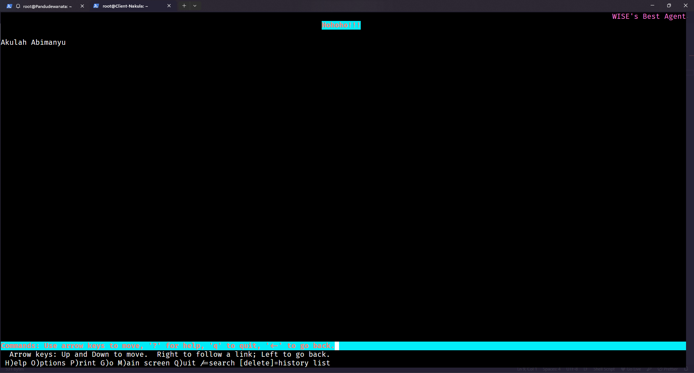

## Nomor 12

### Soal

Setelah itu ubahlah agar url **www.abimanyu.yyy.com/index.php/home** menjadi **www.abimanyu.yyy.com/home**.

### Pembahasan

Pada node Abimanyu, pada path `/etc/apache2/sites-available/abimanyu.b18.com.conf`, kita bisa menambahkan line berikut

> /etc/apache2/sites-available/abimanyu.b18.com.conf

```apache
<VirtualHost *:80>
	ServerAdmin webmaster@localhost
	DocumentRoot /var/www/abimanyu.b18
	ServerName abimanyu.b18.com
	ServerAlias www.abimanyu.b18.com

	Alias "/home" "/var/www/abimanyu.b18/index.php/home"

	ErrorLog ${APACHE_LOG_DIR}/error.log
	CustomLog ${APACHE_LOG_DIR}/access.log combined
</VirtualHost>
```

Lalu restart service `apache2` menggunakan

```
$ service apache2 restart
```

Untuk mencobanya, kita bisa ke node client lalu menjalankan command

```
$ lynx www.abimanyu.b18.com/home
```

Maka akan muncul tampilan seperti ini.


## Nomor 13

### Soal

Selain itu, pada subdomain **www.parikesit.abimanyu.yyy.com**, DocumentRoot disimpan pada /var/www/parikesit.abimanyu.yyy

### Pembahasan

Kita bisa menggunakan cara yang sama dengan nomor 11. Kita bisa membuat file konfigurasi seperti berikut di node Abimanyu.

> /etc/apache2/sites-available/parikesit.abimanyu.b18.com.conf

```apache
<VirtualHost *:80>
	ServerAdmin webmaster@localhost
	DocumentRoot /var/www/parikesit.abimanyu.b18
	ServerName parikesit.abimanyu.b18.com
	ServerAlias www.parikesit.abimanyu.b18.com

	ErrorLog ${APACHE_LOG_DIR}/error.log
	CustomLog ${APACHE_LOG_DIR}/access.log combined
</VirtualHost>
```

Lalu copy folder yang ada di drive resources ke `/var/www/` dengan nama **parikesit.abimanyu.b18**. Setelah itu, kita bisa mengaktifkan website tersebut dan restart service `apache2` menggunakan

```
$ a2ensite parikesit.abimanyu.b18.com.conf
$ service apache2 restart
```

Untuk mencobanya, kita bisa ke node client lalu menjalankan command

```
$ lynx www.parikesit.abimanyu.b18.com
```

Maka akan muncul tampilan seperti ini.

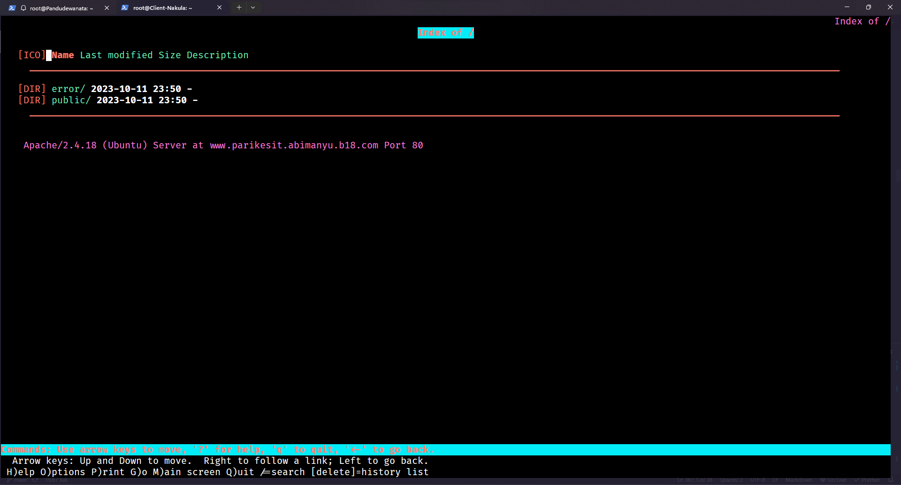

## Nomor 14

### Soal

Pada subdomain tersebut folder /public hanya dapat melakukan directory listing sedangkan pada folder /secret tidak dapat diakses (403 Forbidden).

### Pembahasan

Pada soal ini, kita bisa ke node Abimanyu lalu edit konfigurasi web servernya menjadi seperti berikut.

> /etc/apache2/sites-available/parikesit.abimanyu.b18.com.conf

```apache
<VirtualHost *:80>
	ServerAdmin webmaster@localhost
	DocumentRoot /var/www/parikesit.abimanyu.b18
	ServerName parikesit.abimanyu.b18.com
	ServerAlias www.parikesit.abimanyu.b18.com

	<Directory /var/www/parikesit.abimanyu.b18/public>
    		Options +Indexes
	</Directory>

	<Directory /var/www/parikesit.abimanyu.b18/secret>
		Deny from all
	</Directory>

	ErrorLog ${APACHE_LOG_DIR}/error.log
	CustomLog ${APACHE_LOG_DIR}/access.log combined
</VirtualHost>
```

Lalu restart service `apache2` menggunakan

```
$ service apache2 restart
```

Untuk mencobanya, kita bisa ke node client lalu menjalankan command

```
$ lynx www.parikesit.abimanyu.b18.com/public
```

dan

```
$ lynx www.parikesit.abimanyu.b18.com/secret
```

Maka akan muncul tampilan seperti ini.

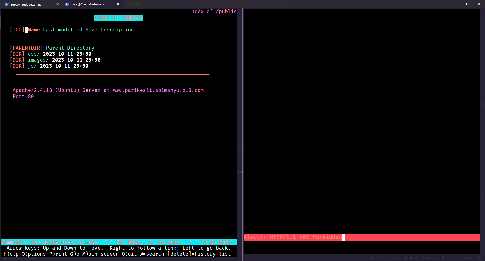

## Nomor 15

### Soal

Buatlah kustomisasi halaman error pada folder /error untuk mengganti error kode pada Apache. Error kode yang perlu diganti adalah 404 Not Found dan 403 Forbidden.

### Pembahasan

Pada soal ini, kita bisa ke node Abimanyu lalu edit konfigurasi web servernya menjadi seperti berikut.

> /etc/apache2/sites-available/parikesit.abimanyu.b18.com.conf

```apache
<VirtualHost *:80>
	ServerAdmin webmaster@localhost
	DocumentRoot /var/www/parikesit.abimanyu.b18
	ServerName parikesit.abimanyu.b18.com
	ServerAlias www.parikesit.abimanyu.b18.com

	<Directory /var/www/parikesit.abimanyu.b18/public>
    		Options +Indexes
	</Directory>

	<Directory /var/www/parikesit.abimanyu.b18/secret>
		Deny from all
	</Directory>

	ErrorLog ${APACHE_LOG_DIR}/error.log
	CustomLog ${APACHE_LOG_DIR}/access.log combined

	ErrorDocument 403 /error/403.html
	ErrorDocument 404 /error/404.html
</VirtualHost>
```

Lalu restart service `apache2` menggunakan

```
$ service apache2 restart
```

Untuk mencobanya, kita bisa ke node client lalu menjalankan command

```
$ lynx www.parikesit.abimanyu.b18.com/secret
```

untuk mencoba error 403 forbidden, dan

```
$ lynx www.parikesit.abimanyu.b18.com/link-random
```

untuk mencoba error 404 not found. Maka akan muncul tampilan seperti ini.

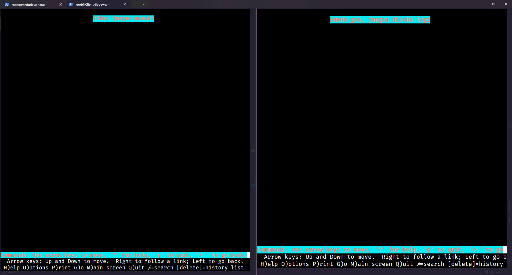

## Nomor 16

### Soal

Buatlah suatu konfigurasi virtual host agar file asset **www.parikesit.abimanyu.yyy.com/public/js** menjadi **www.parikesit.abimanyu.yyy.com/js**

### Pembahasan

Pada soal ini, kita bisa ke node Abimanyu lalu edit konfigurasi web servernya menjadi seperti berikut.

> /etc/apache2/sites-available/parikesit.abimanyu.b18.com.conf

```apache
<VirtualHost *:80>
	ServerAdmin webmaster@localhost
	DocumentRoot /var/www/parikesit.abimanyu.b18
	ServerName parikesit.abimanyu.b18.com
	ServerAlias www.parikesit.abimanyu.b18.com

	<Directory /var/www/parikesit.abimanyu.b18/public>
    		Options +Indexes
	</Directory>

	<Directory /var/www/parikesit.abimanyu.b18/secret>
		Deny from all
	</Directory>

	Alias "/js" "/var/www/parikesit.abimanyu.b18/public/js"

	ErrorLog ${APACHE_LOG_DIR}/error.log
	CustomLog ${APACHE_LOG_DIR}/access.log combined

	ErrorDocument 403 /error/403.html
	ErrorDocument 404 /error/404.html
</VirtualHost>
```

Lalu restart service `apache2` menggunakan

```
$ service apache2 restart
```

Untuk mencobanya, kita bisa ke node client lalu menjalankan command

```
$ lynx www.parikesit.abimanyu.b18.com/js
```

Maka akan muncul tampilan seperti ini.

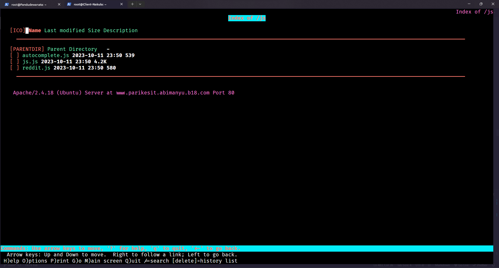

## Nomor 17

### Soal

Agar aman, buatlah konfigurasi agar **www.rjp.baratayuda.abimanyu.yyy.com** hanya dapat diakses melalui port 14000 dan 14400.

### Pembahasan

Pada soal ini, kita harus membuat webserver untuk www.rjp.baratayuda.abimanyu.b18.com terlebih dahulu. Kita bisa menggunakan cara yang sama seperti nomor 11, yaitu ke node Abimanyu kemudian rename folder **rjp.baratayuda.abimanyu.yyy.com** yang diperoleh dari drive resources menjadi **rjp.baratayuda.abimanyu.b18** lalu copy folder tersebut ke `/var/www`. Selanjutnya, tambahin file konfigurasi di `/etc/apache2/sites-available/rjp.baratayuda.abimanyu.b18.com.conf` berisi

> /etc/apache2/sites-available/rjp.baratayuda.abimanyu.b18.com.conf

```apache
<VirtualHost *:14000 *:14400>
	ServerAdmin webmaster@localhost
	DocumentRoot /var/www/rjp.baratayuda.abimanyu.b18
	ServerName rjp.baratayuda.abimanyu.b18.com
	ServerAlias www.rjp.baratayuda.abimanyu.b18.com

	ErrorLog ${APACHE_LOG_DIR}/error.log
	CustomLog ${APACHE_LOG_DIR}/access.log combined
</VirtualHost>

<VirtualHost *:80>
	ServerName rjp.baratayuda.abimanyu.b18.com
	ServerAlias www.rjp.baratayuda.abimanyu.b18.com

	Redirect 403 /
</VirtualHost>

```

Setelah itu, kita bisa mengaktifkan website tersebut dan restart service `apache2` menggunakan

```
$ a2ensite rjp.baratayuda.abimanyu.b18.com.conf
$ service apache2 restart
```

Untuk mencobanya, kita bisa ke node client lalu menjalankan command

```
$ lynx www.rjp.baratayuda.abimanyu.b18.com
```

Tampilan yang muncul yaitu 403 forbidden.
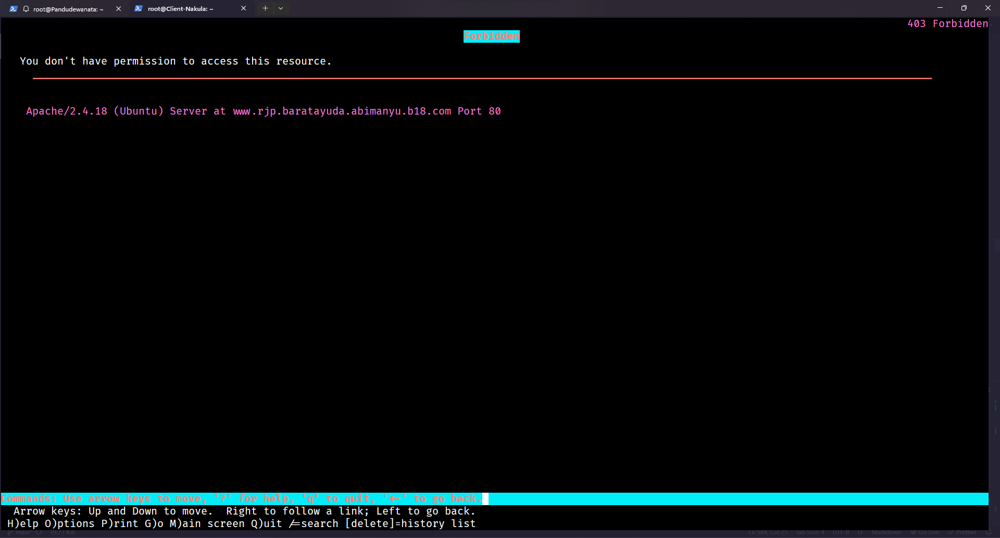

Jika kita menjalankan command berikut,

```
$ lynx www.rjp.baratayuda.abimanyu.b18.com:14000
atau
$ lynx www.rjp.baratayuda.abimanyu.b18.com:14400
```

Maka akan muncul tampilan seperti ini.

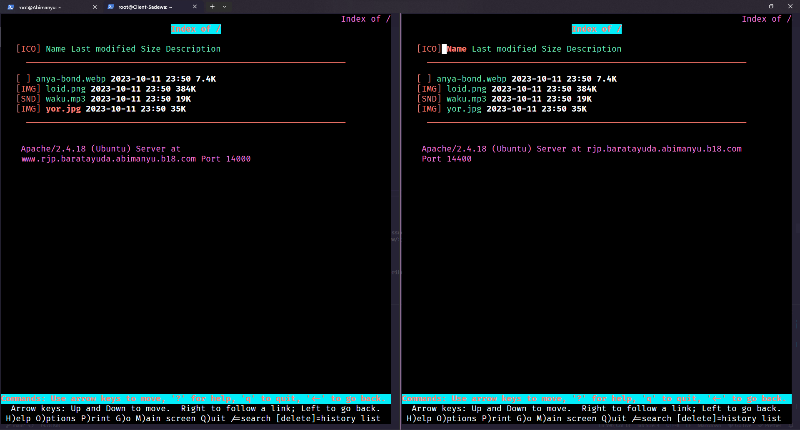

## Nomor 18

### Soal

Untuk mengaksesnya buatlah autentikasi username berupa “Wayang” dan password “baratayudayyy” dengan yyy merupakan kode kelompok. Letakkan DocumentRoot pada /var/www/rjp.baratayuda.abimanyu.yyy.

### Pembahasan

Pada soal ini, kita bisa ke node Abimanyu lalu menjalankan perintah berikut untuk membuat user untuk autentikasi

```
$ htpasswd -c /etc/apache2/.htpasswd Wayang
New password: baratayudab18
Re-type new password: baratayudab18
Adding password for user Wayang
```

Kemudian kita bisa edit konfigurasi seperti berikut

> /etc/apache2/sites-available/rjp.baratayuda.abimanyu.b18.com.conf

```apache
<VirtualHost *:14000 *:14400>
	ServerAdmin webmaster@localhost
	DocumentRoot /var/www/rjp.baratayuda.abimanyu.b18
	ServerName rjp.baratayuda.abimanyu.b18.com
	ServerAlias www.rjp.baratayuda.abimanyu.b18.com

	<Directory /var/www/rjp.baratayuda.abimanyu.b18>
		AuthType Basic
		AuthName "Autentikasi Dulu"
		AuthUserFile "/etc/apache2/.htpasswd"
		Require user Wayang
	</Directory>

	ErrorLog ${APACHE_LOG_DIR}/error.log
	CustomLog ${APACHE_LOG_DIR}/access.log combined
</VirtualHost>

<VirtualHost *:80>
	ServerName rjp.baratayuda.abimanyu.b18.com
	ServerAlias www.rjp.baratayuda.abimanyu.b18.com

	Redirect 403 /
</VirtualHost>
```

Setelah itu, kita bisa restart service `apache2` menggunakan

```
$ service apache2 restart
```

Untuk mencobanya, kita bisa ke node client lalu menjalankan command

```
$ lynx www.rjp.baratayuda.abimanyu.b18.com:14000
atau
$ lynx www.rjp.baratayuda.abimanyu.b18.com:14400
```

Maka akan muncul tampilan seperti ini.

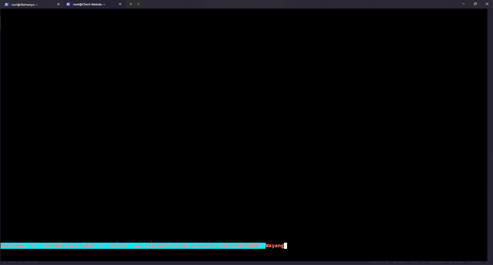
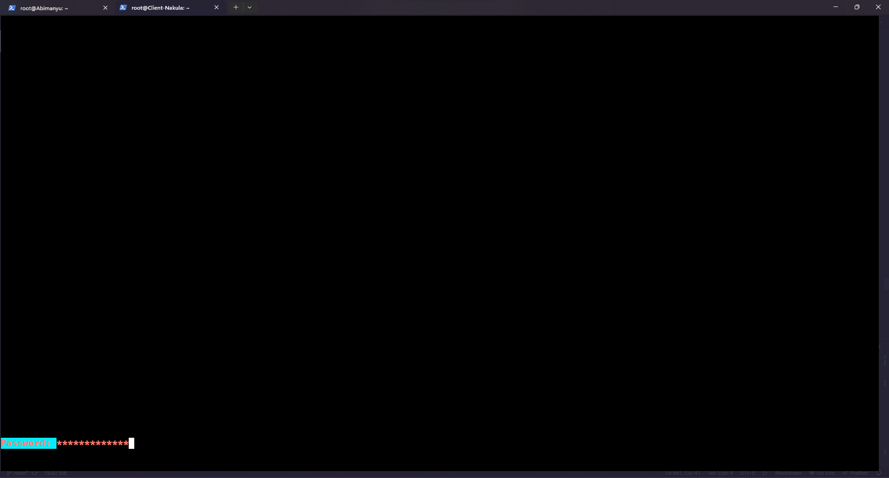
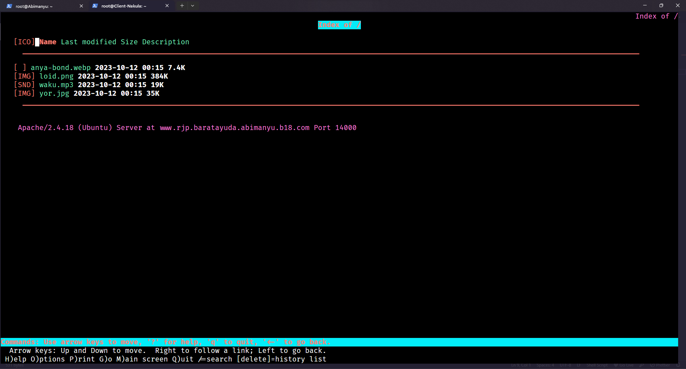

## Nomor 19

### Soal

Buatlah agar setiap kali mengakses IP dari Abimanyu akan secara otomatis dialihkan ke www.abimanyu.yyy.com **(alias)**

### Pembahasan

Untuk soal ini, kita bisa ke node Abimanyu lalu edit konfigurasi seperti berikut.

> /etc/apache2/sites-available/abimanyu.b18.com.conf

```apache
<VirtualHost *:80>
	ServerAdmin webmaster@localhost
	DocumentRoot /var/www/abimanyu.b18
	ServerName abimanyu.b18.com
	ServerAlias www.abimanyu.b18.com
	ServerAlias 192.187.1.2

	Alias "/home" "/var/www/abimanyu.b18/index.php/home"

	ErrorLog ${APACHE_LOG_DIR}/error.log
	CustomLog ${APACHE_LOG_DIR}/access.log combined
</VirtualHost>
```

Lalu restart service `apache2` menggunakan

```
$ service apache2 restart
```

Untuk mencobanya, kita bisa ke node client lalu menjalankan command

```
$ lynx 192.187.1.2
```

Maka akan muncul tampilan seperti ini.


## Nomor 20

### Soal

Karena website **www.parikesit.abimanyu.yyy.com** semakin banyak pengunjung dan banyak gambar gambar random, maka ubahlah request gambar yang memiliki substring “abimanyu” akan diarahkan menuju abimanyu.png.

### Pembahasan

Untuk soal ini, kita bisa ke node Abimanyu lalu di path `/var/www/parikesit.abimanyu.b18`, kita dapat menambahkan file `.htaccess` seperti ini

> /var/www/parikesit.abimanyu.b18/.htaccess

```apache
RewriteEngine On
RewriteBase /
RewriteCond %{REQUEST_URI} !/public/images/abimanyu.png
RewriteRule .*abimanyu.*\.(jpg|jpeg|png|webp)$ /public/images/abimanyu.png [NC,L]
```

Penjelasan:

- **RewriteEngine On**: untuk mengaktifkan modul rewrite
- **RewriteBase /**: rewrite akan diaplikasikan pada URL relatif dari root website
- **RewriteCond %{REQUEST_URI} !/public/images/abimanyu.png**: kondisi ini cek apabila URI tidak mengandung `/public/images/abimanyu.png`
- **RewriteRule ._abimanyu._\.(jpg|jpeg|png|webp)$ /public/images/abimanyu.png [NC,L]**: jika URI terdapat "abimanyu" dan merupakan tipe file gambar seperti jpg, jpeg, png, dan webp maka akan menulis kembali URL menjadi `/public/images/abimanyu.png`

Kemudian, kita bisa edit konfigurasi seperti berikut

> /etc/apache2/sites-available/parikesit.abimanyu.b18.com.conf

```apache
<VirtualHost *:80>
	ServerAdmin webmaster@localhost
	DocumentRoot /var/www/parikesit.abimanyu.b18
	ServerName parikesit.abimanyu.b18.com
	ServerAlias www.parikesit.abimanyu.b18.com

	<Directory /var/www/parikesit.abimanyu.b18>
		Options +FollowSymLinks -Multiviews
		AllowOverride All
	</Directory>

	<Directory /var/www/parikesit.abimanyu.b18/public>
    		Options +Indexes
	</Directory>

	<Directory /var/www/parikesit.abimanyu.b18/secret>
		Deny from all
	</Directory>

	Alias "/js" "/var/www/parikesit.abimanyu.b18/public/js"

	ErrorLog ${APACHE_LOG_DIR}/error.log
	CustomLog ${APACHE_LOG_DIR}/access.log combined

	ErrorDocument 403 /error/403.html
	ErrorDocument 404 /error/404.html
</VirtualHost>

```

Lalu mengaktifkan modul `rewrite` dan restart service `apache2` menggunakan

```
$ a2enmod rewrite
$ service apache2 restart
```

Untuk mencobanya, kita bisa ke node client lalu menjalankan command

```
$ lynx www.parikesit.abimanyu.b18.com/ini/adalah/test/testabimanyutest.png
```

Maka akan muncul tampilan seperti ini untuk mendownload file `/public/images/abimanyu.png`

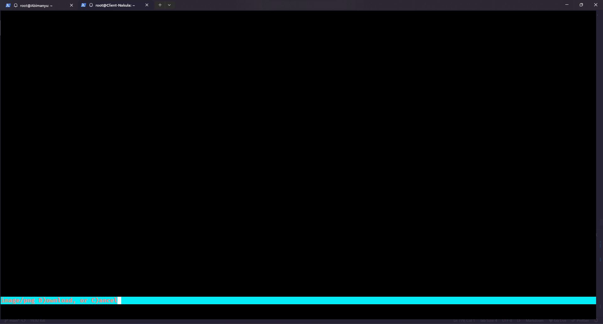
